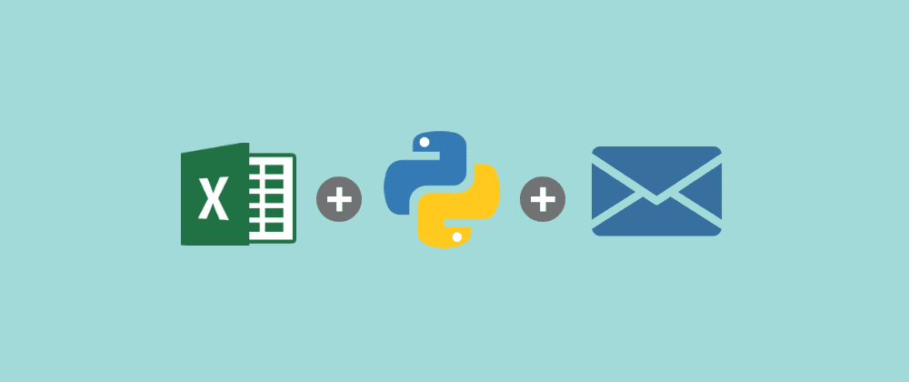
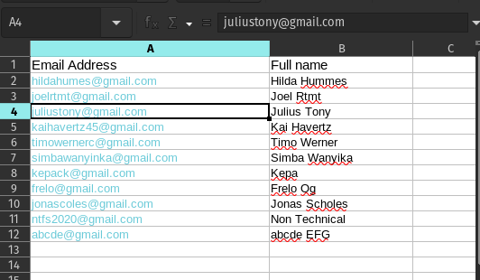

#  EMAIL AUTOMATION WITH PYTHON

Consider you have collected some data using google form and you want to send feedback email to all people responded on you google form. I made  python script to automate the task of sending feedback to multiple emails.

![automate] 

## FILES

-  `data` dir contail excel file with Multiple Email Addressess and Names.
-  `images` dir contain all images associated with automation task.
-  `script.py` python file which contain script for automation task.

    

##  REQUIREMENTS

- Pandas:  for loading our excel spreadsheet from data directory.
- message:   for formating email contents.
- smtplib:  used for email authentication and email transaction (for connecting  gmail account).
- email.mime:  used fro creating email body.

## HOW IT WORKS

- Load and read the excel spreadsheet called  data.xlsx
- composing email with python(Build email content and body)
- email authenticaion  with smtplib
- Final to send an email

You can run the script by `python script.py`

